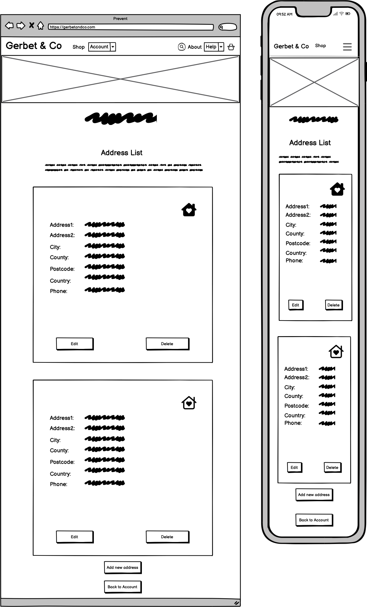
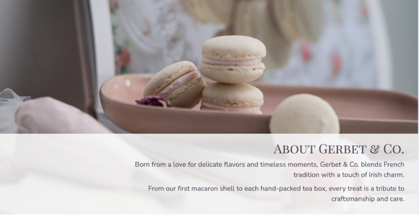
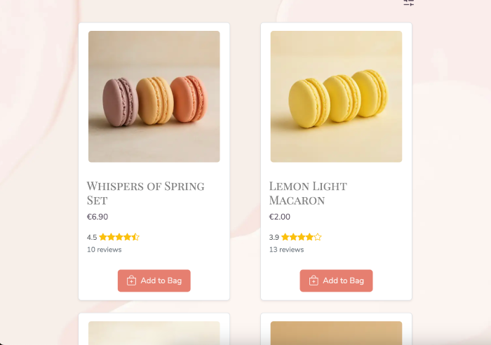

# GERBET & CO


## Table of Contents

-   [Project Description](#project-description)
    -   [Purpose](#purpose)
    -   [User Demographics](#user-demographics)
-   [Business Model & Marketing](#business-model--marketing)
    -   [E-commerce Business Model: Gerbet & Co.](#e-commerce-business-model-gerbet--co)
    -   [Marketing Strategies](#marketing-strategies)
-   [UX design](#ux-design)
    -   [User Stories](#user-stories)
    -   [Wireframes](#wireframes)
    -   [Flowcharts](#flowcharts)
    -   [Key Design Decisions](#key-design-decisions)
        -   [Imagery](#imagery)
        -   [Color Scheme](#colour-scheme)
        -   [Typography](#typography)
        -   [Interactive Elements](#interactive-elements)
-   [Agile Methodology](#agile-methodology)
-   [Features](#features)
    -   [Existing Features](#existing-features)
    -   [Future Features](#future-features)
-   [Technologies](#technologies)
-   [Deployment](#deployment)
    -   [How to clone](#how-to-clone)
    -   [Neon PostgeSQL Database](#neon-postgesql-database)
    -   [Cloudinary API](#cloudinary-api)
    -   [Google API](#google-api)
    -   [Heroku](#heroku)
-   [Testing](#testing)
    -   [Responsivness Testing](#responsivness-testing)
    -   [Browser compatibility Testing](#browser-compatibility-testing)
    -   [User Stories / Features Testing](#user-stories--features-testing)
    -   [Code Validation](#code-validation)
    -   [Performance](#performance)
    -   [Known Issues](#known-issues)
-   [Credits](#credits)
    -   [Media](#media)
    -   [Code](#code)
-   [Acknowledgments](#acknowledgments)

[Back to top](#table-of-contents)

---

# Project Description

Gerbet & Co. is a full-stack e-commerce platform offering luxury handmade French-style macarons and curated tea blends. Built using Django, HTMX, Bootstrap 5 CSS, and PostgreSQL (Neon), the site delivers an elegant, user-friendly shopping experience with a focus on small-batch quality, storytelling, and gift-ready presentation.

The platform includes features such as product filtering, real-time cart updates, Stripe integration, customer account management, and admin-controlled product management. Each product page highlights flavor notes, pairing suggestions, and compelling visuals to support both browsing and buying decisions.

## Purpose

The project was developed as part of a full-stack portfolio to demonstrate strong back-end and front-end integration, dynamic data handling, and thoughtful UX for a niche market. It combines technical precision with a brand-forward design to reflect the personal and artisanal nature of the products.

From a business perspective, the platform supports a direct-to-consumer (DTC) model, empowering small-scale sellers to manage inventory, communicate brand values, and build customer loyalty without relying on third-party marketplaces.

## User Demographics

This site is designed primarily for:

-   Individuals seeking premium, handmade sweets or elegant gift items
-   Tea enthusiasts interested in curated pairings and boutique blends
-   Event planners, couples, and businesses looking for customized favors and treats
-   Customers within Ireland and the broader EU who value artisanal quality and beautiful presentation
-   Mobile and desktop users alike, with responsive design to support browsing and purchasing across devices

[Back to top](#table-of-contents)

---

# Business Model & Marketing

## E-commerce Business Model: Gerbet & Co.

Gerbet & Co. is a small, independent e-commerce business specializing in high-quality French-style macarons and thoughtfully curated tea blends. Rooted in traditional baking techniques and personal craftsmanship, each batch is made in limited quantities with an emphasis on precision, quality, and care.

The shop follows a direct-to-consumer (DTC) model, selling exclusively through its own online platform. This approach allows full control over product quality, packaging, and customer experience. Orders are placed directly through the website and fulfilled from a small-scale production kitchen, with delivery available across Ireland and Europe. Many products are made to order or offered in small seasonal batches to maintain freshness and exclusivity.

## Marketing Strategies

1.  Product-First Storytelling
    Gerbet & Co. emphasizes high-quality ingredients, artisanal techniques, and a meaningful founder story — all of which are showcased in the About page. Visual and written content is crafted to create an emotional connection with customers, presenting each order as a joyful, gift-worthy experience.

2.  Visual Social Media Presence
    A Facebook page layout was created for Gerbet & Co to represent the brand online and support future social media engagement strategies.

    

3.  Email Marketing with a Personal Touch
    Subscribers receive curated emails including seasonal collection announcements, restock alerts, and macaron-tea pairing ideas. Limited batch drops and early access to new products help create urgency and community around the brand.

4.  Niche Positioning
    Marketing efforts are tailored to specific audiences such as gift buyers, tea enthusiasts, and event planners. Customizable options for weddings, birthdays, and corporate gifts allow Gerbet & Co. to stand out in premium gifting categories.

5.  Local SEO & Community Involvement
    To strengthen local visibility, keywords like "macarons Dublin" and "sweet gist ideas" are used throughout the site. The brand also explores partnerships with local businesses and participates in community events and pop-ups to build grassroots awareness.

6.  Focus on the Gifting Experience
    Every product is packaged with care, using minimal yet elegant design. Optional handwritten notes and curated gift sets are offered, making the experience ideal for occasions like anniversaries, holidays, and thank-you gifts.

##

[Back to top](#table-of-contents)

---

# UX Design

## User Stories

The list of user stories can be found in [Gerbet & Co GitHub project](https://github.com/users/tayapro/projects/5).

## Wireframes

### Landing page


### Products page


### Product view page


### Account page


### Account profile page


### Accout profile edit page


### Account profile password update page


### Account address list page



### Account create/update address pages


### Account delete page


### Account order list page


### Account order view page


### Bag page


### Checkout page


### Checkout success page


### Login page


### Register page


### Logout page


### Forget password page


### Error pages


## Flowcharts

Diagrams.net (Draw.io) was used to create the Entity Relationship Diagram (ERD) for the Gerbet & Co project.
It provided a clear and accessible way to map out model relationships and plan the database structure effectively.


## Key Design Decisions

### Imagery

Gerbet & Co embraces a soft and elegant aesthetic, inspired by the charm of artisanal treats and soft elegance.
Product and lifestyle imagery focuses on seasonal macarons, tea moments, and thoughtfully styled packaging
to convey warmth, indulgence, and a handcrafted feel. Each visual was chosen to reflect the calm,
refined nature of the brand.

### Color Scheme

The project applies a refined palette rooted in natural, dessert-inspired tones.
Custom CSS variables define the primary accents:

<table>
    <tr>
        <td></td>
        <td>a muted botanical green</td>
    </tr>
    <tr>
        <td></td>
        <td>a delicate blush coral</td>
    </tr>
    <tr>
        <td></td>
        <td>a deep plum with softened opacity</td>
    </tr>
</table>

These colors are used thoughtfully across backgrounds, buttons, and accents to maintain a cohesive,
gentle design throughout the site.

### Typography

Gerbet & Co uses a font pairing that evokes both elegance and readability:

-   **Playfair Display SC** is used for headings, adding a sense of timelessness and quiet sophistication.
-   **Nunito Sans** supports the main body text, ensuring clarity, balance, and a modern finish.

This combination provides a calm, welcoming reading experience while aligning with the brand's
handcrafted and refined identity.

[Back to top](#table-of-contents)

---

# Agile Methodology

## GitHub Projects

GitHub Projects was utilized to manage this project following Agile principles. While not a dedicated project management platform, it proved effective when paired with labels, issues, and project boards to organize tasks, track progress, and maintain workflow transparency.

The link to the Gerbet & Co board can be found [here](https://github.com/users/tayapro/projects/5).

Using GitHub Projects, user stories, issues, and tasks were organized and tracked weekly via a simple Kanban board. This approach provided clear visibility into progress and allowed for easy updates and adjustments throughout the development process.


The **MoSCoW prioritization method** was used alongside custom GitHub project labels to effectively organize tasks. This approach ensured that the most critical features were addressed first, helping to maintain focus and make the best use of the available time.

## Milestones

Milestones were used to group related user stories, helping to structure the development process and maintain focus.


This approach supported timely delivery by aligning tasks with priorities and deadlines, ensuring that key features were completed in the right order.

## MoSCoW Prioritization

Before implementation began, high-level Epics were broken down into smaller, actionable user stories. This allowed for the application of the MoSCoW prioritization method within the GitHub Issues tab, using custom labels to categorize and manage task importance.

The MoSCoW method was used to group tasks as follows:

-   **Must Have** – Essential features required for the core functionality and successful delivery.
-   **Should Have** – High-value tasks that enhance the product but aren't critical for launch.
-   **Could Have** – Nice-to-have features that provide added value but can be deferred.
-   **Won't Have** – Tasks intentionally excluded from the current development cycle.

This structured approach ensured that key features were delivered first, while still making space for future
enhancements to improve the user experience in later iterations.

[Back to top](#table-of-contents)

---

# Features

## Existing Features

### F01 Navigation Bar

The Gerbet & Co site features a sticky, responsive navbar with a refined logo and a clean, user-friendly layout. Navigation elements adjust based on user status: logged-in users see a profile dropdown menu and a real-time shopping bag counter, while visitors are presented with a _Get Started_ button to encourage account creation or login. A collapsible offcanvas search panel offers quick access to product browsing without leaving the current page. The navbar is fully optimized for mobile devices, providing seamless navigation with touch-friendly elements and maintaining accessibility across all screen sizes.


#### Search

Gerbet & Co includes a user-friendly offcanvas search panel, allowing customers to quickly explore products without leaving the current page. The search sidebar is easily accessible from the navbar and opens with a smooth transition. It features a simple input field with placeholder text ("Macaron, tea, or a treat...") to guide users.
To assist discovery, curated suggestions such as Macarons and Tea are also presented as quick-access buttons, helping users find what they're looking for with ease.


#### Shopping Bag

Gerbet & Co. provides a seamless shopping experience with real-time updates. When users add a product to their bag, the bag counter in the navbar updates instantly, and a toast message appears to confirm the action. The toast displays the product name and includes a dismiss option, offering clear, unobtrusive feedback without interrupting the browsing flow.


#### Popover Menu for Mobile

Gerbet & Co. uses a clean popover menu on smaller screens, offering quick access to Search, About, FAQs, Contact Us, Account, and Logout/Login links.


The menu:

-   Opens from the right with a smooth slide effect.
-   Maintains a minimal, elegant design.
-   Ensures easy navigation without clutter.

Built using Bootstrap's offcanvas component for a seamless mobile experience.

### F02 Home page

The Gerbet & Co landing page is thoughtfully crafted to create an inviting first impression, blending visual
elegance with a smooth user experience.

It features:

#### Hero Section

The page opens with a large hero banner, featuring a heartfelt tagline that captures the essence of the brand. Two clear call-to-action buttons invite users to explore either the Macarons Collection or the Tea Collection, ensuring easy
navigation right from the start.

<p float="left">
&nbsp;&nbsp;&nbsp;&nbsp;

</p>

#### Featured Collections

A highlighted section showcases seasonal selections and customer favorites. Each product card is beautifully presented
with a product image, name, and an optional label like "spring" or "bestseller," helping users quickly spot new
arrivals and popular treats.

<p float="left">
&nbsp;&nbsp;&nbsp;&nbsp;

</p>

#### Service Highlights

A dedicated services area reassures customers by highlighting key benefits: express delivery across Europe,
chilled shipping for freshness, eco-friendly packaging, and responsive customer service. Simple icons and concise descriptions make the services easy to understand at a glance.

<p float="left">
&nbsp;&nbsp;&nbsp;&nbsp;

</p>

#### About Section

An elegant introduction to the story behind Gerbet & Co. This section shares the brand's passion for delicate flavors and timeless moments, blending French tradition with Irish charm. It adds warmth and authenticity to the overall experience.

<p float="left">
&nbsp;&nbsp;&nbsp;&nbsp;

</p>

#### Awards & Recognition

A trusted and celebrated section showcases awards and accolades, such as "Best Seller Award" and "Premium Quality." This helps to build customer confidence and reflects the brand's commitment to quality and excellence.

<p float="left">
&nbsp;&nbsp;&nbsp;&nbsp;

</p>

#### Newsletter Signup

Positioned before the footer, the newsletter signup invites visitors to join the Gerbet & Co community. A soft message promises sweet updates without spam, offering a friendly way to stay connected with seasonal launches and news.

<p float="left">
&nbsp;&nbsp;&nbsp;&nbsp;

</p>

#### Footer

The footer contains essential links to shop categories, help pages, shipping policies, and social media profiles. It is styled to match the overall design, reinforcing the brand identity while providing easy access to important information.

<p float="left">
&nbsp;&nbsp;&nbsp;&nbsp;

</p>

### F03 Products page

The Products page presents the Gerbet & Co collection with an inviting and organized layout.
Each item is displayed with a rich image, name, price, star rating, and a quick "Add to Bag" option, offering a smooth shopping experience without unnecessary steps.

A Filter and Sort Sidebar helps users easily refine results by category, price range, and rating, making it simple to discover the macaron or tea collections.
This feature supports a faster, more personalized browsing experience.

<p float="left">
&nbsp;&nbsp;&nbsp;&nbsp;

</p>

The visual style of the page stays true to the brand's elegant and delicate identity, using soft tones,
rounded cards, and thoughtful spacing to create an effortless and enjoyable atmosphere.

### F04 Product view page

The Product View page offers a detailed look at each item in the collection, highlighting its description, ingredients, weight, and calorie information.
Customers can easily review the product's average rating, presented with star icons — no written feedback is collected, keeping the experience clean and focused.

<p float="left">
&nbsp;&nbsp;&nbsp;&nbsp;

</p>

If a user has purchased the product in the past, they are given the option to submit their own star rating.
A _Back_ button ensures smooth navigation, allowing users to return to browsing without any hassle.

### F05 Shopping bag page

The Shopping Bag page provides a clear and inviting overview of the selected items, complete with images, product details, and pricing.
Users can easily adjust product quantities with a simple click, and remove items if needed.

<p float="left">
&nbsp;&nbsp;&nbsp;&nbsp;

</p>

Quantity changes automatically update:

-   The order summary section, recalculating subtotal, delivery, and grand total.
-   The shopping bag counter in the navbar, keeping everything in sync.

This seamless real-time behavior is powered by HTMX, ensuring a smooth experience without full page reloads.

Once happy with their selection, users can click the _Proceed to Checkout_ button to move into the checkout flow.

### F06 Checkout page

The checkout page at Gerbet & Co. is designed to provide a smooth and secure experience. Users can choose to
either use their saved default address or manually fill out the delivery form. If entering new delivery details,
there is an option to save them as the new default for future purchases.

The checkout form is fully integrated with Stripe API for secure payment processing. After entering delivery
details, users can review and confirm their order before completing payment.

<p float="left">
&nbsp;&nbsp;&nbsp;&nbsp;

</p>

For mobile devices, the order summary is prioritized and displayed at the top of the page, ensuring users can
easily review their total before filling out delivery and payment sections listed below.

### F07 Guest Checkout

Gerbet & Co allows users to complete their purchase as a guest without creating an account.
This feature ensures a fast and hassle-free checkout experience for new or occasional customers.
Guests can provide their shipping and billing details during checkout, receive email notifications
about their order, and enjoy a secure payment process via Stripe — all without needing to register.

### F08 Checkout success page

After completing the checkout process, users are directed to a clean and friendly success page.
A personalized thank you message confirms the order, accompanied by the order number for easy reference.

<p float="left">
&nbsp;&nbsp;&nbsp;&nbsp;

</p>

An order summary clearly lists the purchased items along with subtotal, delivery cost, and total paid.
A _Continue Shopping_ button is provided, encouraging users to seamlessly return to browsing more products without any interruption.

### F09 About page

The About page shares the story behind Gerbet & Co., a tribute to tradition, craft, and small joys. Through a blend of personal notes from the fictional founders, Isabelle Gerbet and Liam Murphy, the page weaves a light narrative about their journey — from French roots to their cozy Irish kitchen — highlighting their passion for delicate flavors and heartfelt baking. Designed with a warm, inviting layout, the page adds a human touch to the brand's identity, creating a sense of connection and authenticity.

<p float="left">
&nbsp;&nbsp;&nbsp;&nbsp;

</p>

### F10 FAQ Page

The FAQ page is designed to offer quick, friendly support for visitors. It is divided into sections such as Tasting & Treats, Your Sweet Profile, Orders, Payment, and Delivery. Each section contains expandable questions and answers, helping users find the information they need without leaving the page.
At the end of the list, a "Still Curious? Contact Us" link directs users to the Contact Us page, offering a simple way to get personalized assistance.

<p float="left">
&nbsp;&nbsp;&nbsp;&nbsp;

</p>

### F11 Contact us page

The Contact Us page features a simple, user-friendly form where visitors can quickly reach out with questions,
feedback, or special requests.
The form collects essential details — name, email, and message — ensuring smooth and efficient communication.

To maintain quality interactions, the form uses built-in HTML5 validation combined with custom error messages.
Users are required to fill out all fields before submitting, with personalized prompts like "Please enter your name."
and "Please enter your message." to guide them if any fields are left empty.

<p float="left">

</p>

The page design remains consistent with the brand's warm and welcoming aesthetic, enhanced by a
vibrant macaron background.

### F12 Sort & filter sidebar

The Sort & Filter sidebar empowers users to refine and personalize their browsing experience with ease. Users can sort products by price (low to high or high to low) or by popularity, helping them quickly find the best fit for their preferences.
Filtering options include category selection (Macarons, Macaron Sets, Tea), rating (5 stars, 4+ stars, or 3+ stars), and price range adjustment.

<p float="left">

</p>

Active filters are displayed as tags above the product grid, with an option to clear all filters in one click.
The sidebar enhances usability, making product discovery smooth, intuitive, and enjoyable across all devices.

### F13 My account page

The My Account page offers users a welcoming dashboard with quick access to manage their personal information and orders.
The page is divided into three clear sections:

-   **Resident Profile**: Users can easily update their name, and password to keep their profile up to date.
-   **Address Book**: Allows users to view, add, and edit their delivery addresses, ensuring their favorite treats always find them, whether at home or away.
-   **Deliveries at Door**: Provides an overview of past orders, offering a simple way to track what's been delivered and revisit favorite purchases.

<p float="left">
&nbsp;&nbsp;&nbsp;&nbsp;

</p>

This setup creates a smooth and user-friendly experience, helping users stay connected with their orders and profile in just a few clicks.

### F14 Resident Profile Page

The Resident Profile page offers users a simple and secure way to manage their personal information.

<p float="left">
&nbsp;&nbsp;&nbsp;&nbsp;

</p>

Here, users can:

-   View their name and email address associated with their account.
-   Update their details easily by clicking the "Change Details" button.
-   Change their password securely with a dedicated option.

A _Back to My Account_ button ensures smooth navigation, allowing users to return to the main account dashboard with one click.

### F15 Resident Profile - Change details page

The Change Details page allows users to easily update their name associated with their account.

<p float="left">
&nbsp;&nbsp;&nbsp;&nbsp;

</p>

Key features:

-   The form is pre-filled with the user's current details for convenience.
-   HTML5 and custom validations ensure correct input formats.
-   Users can update the fields and submit changes smoothly.

After a successful update, the user sees a Django message:
"Your profile has been successfully changed."

After submitting, the user is redirected back to their Resident Profile, where the updated information is displayed immediately.

### F16 Resident Profile - Change Password Page

The Change Password page offers users a secure way to update their login credentials.

<p float="left">
&nbsp;&nbsp;&nbsp;&nbsp;

</p>

Key features:

-   The user must enter their old password, new password, and confirm the new password.
-   Django's built-in password validation rules are applied.
-   Clear validation feedback is provided during form completion.

After a successful password change, the user is redirected to the login page and the message:
"Your password has been successfully changed. Please log in with your new password."

### F17 Address Book - Address Management (CRUD)

The Address Book page offers a convenient way for users to manage their saved delivery addresses. Each entry displays detailed information, including the street address, city, county, postcode, country, and phone number, ensuring quick reference at a glance.

<p float="left">
&nbsp;&nbsp;&nbsp;&nbsp;

</p>

Users can easily:

-   Edit existing addresses to reflect any changes.
-   Delete addresses that are no longer needed.
-   Add New Address to their list to accommodate multiple delivery destinations.

User can designate one address as their default address, which is visually highlighted with a small filled home icon for quick identification. All other addresses display an empty home icon, allowing users to easily set a new default
address with a single click. After updating the default address, the user will see a confirmation message:
"Default shipping address updated."

The default address is automatically pre-filled during checkout but can be changed at any time.

#### CREATE

The Create Address page allows users to add new delivery locations to their personal Address Book. Users can enter essential information such as street address, city, postcode, country, and phone number.<br>
Required fields are clearly marked and enforced with HTML5 validation to ensure data completeness.

<p float="left">
&nbsp;&nbsp;&nbsp;&nbsp;

</p>

Custom validation is also implemented to maintain data quality — for example, users are prompted with text like:

-   "Ensure this value has at least 2 characters (it has 1)" for too-short entries,
-   "Enter a valid phone number (7-15 digits, optional '+')" for invalid phone formats.

Additionally, users can set the newly created address as their default shipping address for future orders.

After successful submission, the new address is saved to their Address Book.

#### READ

The READ functionality is implemented on the Address Book page, where users can view all their saved delivery addresses in one convenient place. Each address is clearly displayed with essential details like street name, city, postcode, and country. This setup allows users to easily review their information at a glance and manage their favorite delivery spots.

#### UPDATE

The Update Address page allows users to modify their existing delivery information using a form that mirrors the structure and validation of the Create Address form. Users can update their street address, town or city, postcode, country, and phone number to keep their delivery details accurate and up to date.

<p float="left">
&nbsp;&nbsp;&nbsp;&nbsp;

</p>

Just like in the creation form, users can select the option to set the updated address as their new default shipping address. If selected, it will automatically be prioritized during checkout.

Custom validation is enforced to ensure data consistency:

-   Fields like street address and town or city must have at least 2 characters.
-   Phone numbers must follow a valid format: 7–15 digits, with an optional '+' sign.

Upon successful update, users are redirected back to the Address Book page with a Django success message:
"Address updated successfully."

#### DELETE

When a user chooses to delete a saved address from their Address Book, a confirmation modal window appears to ensure the action is intentional.

<p float="left">

</p>

The modal displays the key details of the address being deleted, providing clarity before proceeding.

The user has two options:

-   Cancel — to safely return without making any changes.
-   Delete — to permanently remove the selected address.

After confirming the deletion, the address is removed from the user's account, and a Django success message appears:
"Address deleted successfully."

### F18 Deliveries at Door

The Deliveries at Door page allows users to view a summary of their past orders, providing quick access to essential delivery information.

<p float="left">
&nbsp;&nbsp;&nbsp;&nbsp;

</p>

Each order entry displays:

-   Order number (e.g., #GCO-ORD-YYYYMMDD-#####)
-   Status (e.g., Paid, Failed, etc.)
-   Date of the order
-   Total amount paid

A "View Details" button is available for each order, allowing users to dive deeper into the order's full breakdown.

### F19 Deliveries at Door - Order details page

The Order details page provides a detailed recap of a specific order, offering users a clear and organized summary of their purchase.

<p float="left">
&nbsp;&nbsp;&nbsp;&nbsp;

</p>

The page displays:

-   Order number for easy reference.
-   Delivery address showing where the treats were sent.

Order summary including:

-   Item(s) subtotal
-   Postage & Packing costs
-   Grand total

Items list showing each product purchased, its quantity, and price.

A _Back to Orders_ button ensures seamless navigation back to the full list of deliveries.

### F20 User Access and Logout pages

#### Register page

The page allows new users to create an account by filling out a simple form.
The registration form includes the required fields.

Password creation is guided by built-in Django password validators.

<p float="left">

</p>

Custom validation is implemented for the first name and last name fields, requiring at least two characters each.
If any input does not meet the criteria, helpful error messages are displayed to guide users.

Upon successful registration, users can immediately log in and begin exploring the site.

#### Login page

The page offers a clean and intuitive form for users to access their accounts securely.
Users are asked to enter their username and password.
For convenience, there are direct links to reset a forgotten password or register for a new account
if the user is not yet a member.

<p float="left">

</p>

If incorrect credentials are provided, the user will see the following message:
"Please enter a correct username and password. Note that both fields may be case-sensitive."

#### Reset password page

The page offers users a straightforward way to request a password reset if they've forgotten their login credentials.
Users simply need to enter the email address associated with their account and click "Send Password Reset Email." Upon submission, a password reset link will be emailed to them if the email matches an existing account.

<p float="left">

</p>

If incorrect or invalid credentials are provided, the user will be informed with the following message:
"Please enter a correct username and password. Note that both fields may be case-sensitive."

#### Password reset sent page

After submitting a password reset request, users are directed to the Password Reset Sent page.
A confirmation message informs users that an email with instructions to reset their password has been
sent to the provided address.

<p float="left">

</p>

If the email does not arrive shortly, users are advised to:

-   Check their spam or junk folder.
-   Try submitting the reset request again.

This page reassures users that the next steps are in progress and encourages them to monitor their inbox for further instructions.

#### Set new password page

The Set New Password page allows users to securely create a new password after initiating a password reset request.
The form requires the user to enter their new password twice for confirmation, ensuring that both entries match.

Password creation is guided by built-in Django password validation rules.

<p float="left">

</p>

After successfully setting a new password, the user will be redirected to the login page and can log in with their updated credentials.

#### Logout page

The page provides a simple, user-friendly confirmation window asking if you are sure you want to log out.
Users can easily choose between staying logged in ("No" button) or ending their session ("Yes" button).
Upon confirmation, the user is securely logged out of their account and redirected to the homepage and see "
You have been logged out" message.

<p float="left">

</p>

### F21 Email Notifications

The application sends automated emails to users at key interaction points to enhance communication and
user experience. The following email types are supported:

-   **Welcome Email** sent to new users after successful registration to greet them and confirm account creation.

    

-   **Password Reset Email**
    Sent when a user requests a password reset, providing a secure link to reset their password.

    

-   **Order Confirmation Email** sent after a successful payment, summarizing the order details and confirming the purchase.

    

-   **Payment Failure Email** sent if a payment attempt fails, informing the user and providing guidance on next steps.

    

-   **Contact Us Email** sent internally when a user submits a message via the "Contact Us" form, allowing prompt follow-up.

    

-   **Subscription Email** sent when a user subscribes to the newsletter, confirming their subscription and welcoming them to the community.

    

### F22 Spinner

To improve the user experience during the checkout process, a loading spinner was implemented.
It appears when the user submits the payment form and remains visible while awaiting a response from the payment provider.

The spinner activates after the user submits the payment and before the result (success or failure) is returned.

Once the payment is successfully processed, the spinner disappears, and the user is redirected to the order confirmation page.

If the payment fails, the spinner also disappears, and an appropriate error message is displayed to the user without reloading the page.

### F23 Admin Panel / Product Management

The admin panel provides a interface for managing the store's products easily and efficiently.
Administrators can:

-   Update the title, description, price, and category assignments for each product.
-   Quickly select or change product categories using a user-friendly multi-select tool.
-   View the current product image and optionally upload a new image by providing a direct URL.
-   Save changes, continue editing, or quickly add new products using the provided action buttons.


#### Other Admin Features

-   **Create New Products**: Add new products by filling in the same fields available for editing: title, description, price, categories, and image URL.
-   **Manage** categories, shipping information, orders, order items, and checkout configuration.

---

> [!NOTE]
> The Gerbet & Co e-commerce website features custom error pages to improve the user experience during unexpected issues.
> Custom pages are provided for common HTTP errors like 400 (Bad Request), 403 (Forbidden), 404 (Not Found), and 500 (Server Error).
> These pages deliver clear, user-friendly messages that maintain the website's consistent design and tone.
> For instance, the 403 page appears when a user tries to access a restricted area without proper authorization.

## Future Features

### Wishlist Functionality

Allow customers to save their favorite macarons, teas into a personal wishlist. This feature would make it easy for users to return and purchase later, while also enabling the option to share their wishlist with friends and family, perfect for gift ideas or special occasions.

### Order Cancellation

Introduce the ability for customers to request a cancellation of their order directly from the 'Deliveries at the Door' section before the order has been processed or shipped. This will offer greater flexibility and control to users, improving overall customer satisfaction and trust.

### Gift Cards

Launch customizable digital gift cards that customers can purchase, personalize with messages, and send electronically. Gift cards would be a thoughtful option for customers who want to share the Gerbet & Co. experience but let recipients choose their own treats.

### Personalized Recommendations

Introduce a smart recommendation engine that suggests products based on a user's browsing habits, purchase history, and wishlist items. This would create a more tailored shopping experience and help customers discover new favorite treats effortlessly.

### Loyalty Program

Create a loyalty rewards system where customers earn points for every purchase, product review, or referral. Points can be redeemed for exclusive discounts, special products, or early access to new collections, encouraging long-term engagement.

### Live Chat Support

Offer a live chat option on the website, allowing customers to quickly get assistance with product inquiries, orders, or account issues. Friendly real-time support would enhance user confidence and provide a more personalized service experience.

[Back to top](#table-of-contents)

---

# Technologies

## Languages

-   Python
-   HTML5
-   CSS
-   JavaScript

## Frameworks, Libraries, Apps

| Name                                                         | Purpose                                             |
| :----------------------------------------------------------- | :-------------------------------------------------- |
| [Django](https://www.djangoproject.com/)                     | Build the app's backend and manages the database    |
| [Gunicorn](https://gunicorn.org/)                            | Use as WSGI server that handles web requests        |
| [Whitenoise](https://whitenoise.readthedocs.io/en/latest/#)  | Work with static files                              |
| [Gitpod](https://www.gitpod.io/)                             | Serves as cloud-based development environment       |
| [Heroku](heroku.com)                                         | Deploy and Host the application                     |
| [Bootstrap5](https://getbootstrap.com/)                      | Enables responsive design and ready-made components |
| [Neon Console](https://console.neon.tech/)                   | View and manage Gerbet & Co database                |
| [Psycopg2](https://pypi.org/project/psycopg2/)               | Connects Django to PostgreSQL                       |
| [Tinymce](https://www.tiny.cloud/)                           | Provide WYSIWYG editing                             |
| [Cloudinary](https://cloudinary.com/)                        | Store images                                        |
| [Bootstrap Icons](https://icons.getbootstrap.com/)           | Add icons to enhance user experience                |
| [Balsamiq](https://balsamiq.com/)                            | Create the wireframes                               |
| [Photopea](https://www.photopea.com/)                        | Work with images (resize, convert, etc)             |
| [Vmake.ai](https://vmake.ai/image-outpainting)               | Expand the image                                    |
| [Websitemockupgenerator](https://websitemockupgenerator.com) | Create the README Mockup image                      |
| [Diagram.drawio](https://app.diagrams.net/)                  | Create flowcharts                                   |
| Git                                                          | Use for version control                             |
| [GitHub](https://github.com/)                                | Store the source code                               |
| [Pep8ci.herokuapp](https://pep8ci.herokuapp.com)             | Validate Python code                                |
| [W3C HTML Markup Validator](https://validator.w3.org/)       | Validate HTML code                                  |
| [W3C CSS Validator](https://jigsaw.w3.org/css-validator/)    | Validate CSS code                                   |
| [JShint](https://jshint.com/)                                | Validate JS code                                    |

> [!NOTE]
> A complete list of project dependencies is available in the requirements.txt file.

[Back to top](#table-of-contents)

---

# Deployment

> [!NOTE]
> Before starting the deployment process, please note that you need two files in your repository:
>
> 1. `requirements.txt` with all actual dependencies.
> 2. `.env` file with environment variables, it's needed for deployment on Heroku and for local deployment as well. Sample `.env` file:
>
> ```
> SECRET_KEY="<USER_VALUE>"
> DATABASE_URL="<USER_VALUE>"
>
> STRIPE_PUBLIC_KEY="<USER_VALUE>"
> STRIPE_SECRET_KEY="<USER_VALUE>"
> STRIPE_WH_SECRET="<USER_VALUE>"
>
> EMAIL_HOST_USER="<USER_VALUE>"
> EMAIL_HOST_PASSWORD="<USER_VALUE>"
> DEFAULT_FROM_EMAIL='"Gerbet & Co" <"<USER_VALUE>">'
>
> CLOUDINARY_CLOUD_NAME="<USER_VALUE>"
> CLOUDINARY_API_KEY="<USER_VALUE>"
> CLOUDINARY_API_SECRET="<USER_VALUE>"
>
> ```
>
> Also please note that the `DEPLOYMENT` flag in settings.py should be `False`.

## How to clone

1. Head over to the [Gerbet & Co repository](https://github.com/tayapro/gerbet-and-co) on GitHub.
2. Click the **Code** button (located on the right side of the page), select **HTTPS**, and copy the provided link.
3. Open your terminal and navigate to the folder where you want to save the repository.
4. In the terminal, type `git clone`, paste the copied URL, and hit **Enter** to start cloning.

> [!NOTE]
> To update requirements.txt with all actual dependencies, run: \
> `pip3 freeze > requirements.txt` \
> Check `DEBUG` flag in settings.py, should be `False`. \
> \
> Then commit the changes to GitHub, if needed.

## Neon PostgeSQL Database

This project uses Neon Console for PostgreSQL. The `DATABASE_URL` can be found in the Dashboard tab under Connection Details, as Connection string value.

To use your own database, set it up and configure the `DATABASE_URL`.

## Cloudinary API

This project uses the Cloudinary API to store media files, as Heroku doesn't support persistent storage for this type of data.

To get started with Cloudinary:

1. Create an account and log in.
2. Head to the settings page.
3. Click the **"Generate new API key"** button to create your own API credentials.

## Heroku Deployment

Heroku, a cloud platform that enables easy application building, deployment, and management, was chosen for the Gerbet & Co project. \
Follow these steps to deploy the Gerbet & Co app on Heroku:

1. **Fork or Clone the Repository**  
   Start by forking or cloning the [Gerbet & Co repository](https://github.com/tayapro/gerbet-and-co) to your local machine.

2. **Log in to Heroku**  
   Access your Heroku account or create one if you don't have it yet.

3. **Set Up a New Application**  
   Create a new application on Heroku and name it as desired.

4. **Configure Settings**

    - Go to the **Settings** tab in your Heroku dashboard.

    - In the **Config Vars** section, add the following environment variables with your own values:

        - `CLOUDINARY_API_KEY`: Cloudinary API key, see the "Cloudinary API" section above.
        - `CLOUDINARY_API_SECRET`: Cloudinary API secret, see the "Cloudinary API" section above.
        - `CLOUDINARY_CLOUD_NAME`: Cloudinary cloud name, see the "Cloudinary API" section above.
        - `DATABASE_URL`: database connection URL, see the "Neon PostgeSQL Database" section above.
        - `EMAIL_HOST_USER`: Google email address, in current configuration _info.gerbetco@gmail.com_.
        - `EMAIL_HOST_PASSWORD`: Password to send emails using Google API.
        - `SECRET_KEY`: secret key.
        - `STRIPE_PUBLIC_KEY`: publishable key (starts with pk).
        - `STRIPE_SECRET_KEY`: secret key (starts with sk)
        - `STRIPE_WH_SECRET`: signing secret (Wehbook) key (starts with wh).

    - In the **Buildpacks** section, add the **Python** buildpack.

5. **Deploy the Application**
    - Navigate to the **Deploy** tab.
    - Under **App connected to GitHub**, link your GitHub repository.
    - In the **Manual deploy** section, select the `main` branch and click **Deploy Branch** to deploy your app.

> [!NOTE]
> To update requirements.txt with all actual dependencies, run: \
> `pip3 freeze > requirements.txt` \
> Check `DEBUG` flag in settings.py, should be `False`. \
> \
> Then commit the changes to GitHub.

[Back to top](#table-of-contents)

---

# Testing

## Responsivness Testing

The layout has been thoroughly tested and optimized for widely used screen resolutions, based on current usage statistics. Responsive design principles ensure a consistent experience across devices. For smaller or uncommon screen sizes, scroll behavior has been applied where needed to maintain accessibility and prevent layout issues.

## Browser compatibility Testing

Testing has been carried out on the following devices:

Macbook Sanoma Version 14.4.1:

Chrome Version 131.0.6778.265
Firefox Version 134.0.2
Samsung S20:

Chrome Version 132.0.6834.80
iPhone 14:

Safari ios 18.1.1
iPad Air 5th generation:

Safari ios 18.1.1
Windows PC:

Firefox 134.0.2 (Windows 11)
Macbook Pro 2019:

Safari ios 17.6

## User Stories / Features Testing

Feature and user story testing were performed together to ensure a strong alignment between functionality and user expectations. Each feature was verified to support its intended user story, focusing on delivering clear value and a seamless user experience. While individual features and user stories were not listed separately in the final test results spreadsheet, the tests were organized by sections that closely correspond to the implemented features, maintaining logical coverage and clarity.

-   [Test Results Spreadsheet](https://docs.google.com/spreadsheets/d/1nvOqcARGIw93b0v3J0wxBqLBeqMvdN1Np24IdLpj3gQ/edit?usp=sharing)

-   [User Stories](https://github.com/tayapro/gerbet-and-co/issues)

## Known Issues

1. OrderItems not created for failed payments

    When a payment attempt fails (e.g., due to a card decline or insufficient funds), the associated OrderItem records are not generated. This behavior prevents incomplete or unpaid orders from affecting the product inventory or order history but may require manual review if troubleshooting failed transactions.

2. Sort & Filter form accepts isolated symbols

    The sort and filter form allows users to submit non-numeric characters such as "+", "-", or "." by themselves in the price range fields. Although these symbols can be submitted, they do not affect the search results or cause any functional issues.

3. `aria-hidden` issue

    ```
    Blocked aria-hidden on an element because its descendant retained focus. The focus must not be
    hidden from assistive technology users. Avoid using aria-hidden on a focused element or its
    ancestor. Consider using the inert attribute instead, which will also prevent focus. For more
    details, see the aria-hidden section of the WAI-ARIA specification
    at https://w3c.github.io/aria/#aria-hidden.
    ```

[Back to top](#table-of-contents)

---

# Credits

## Content

-   The fonts used were imported from Google Fonts.
-   The icons were taken from [Bootstrap Icons](https://icons.getbootstrap.com/) and [Lucide Icons](https://lucide.dev/icons).

## Media

Macaron images were generated with the assistance of ChatGPT image tools for visual consistency across the project.

-   FAQ page <a href="https://www.freepik.com/free-photo/valentines-day-postcard-with-assorted-macarons-pastel-shades-arranged-heart-shape-pris_136731678.htm">Image by frimufilms on Freepik</a>

-   About page:

    -   <a href="https://www.freepik.com/free-photo/young-couple-cooking-together_10041378.htm#fromView=search&page=2&position=41&uuid=9e3ae2f4-1b5c-4d64-90e5-c424de34ca7e&query=bakery+couple">Image by wayhomestudio on Freepik</a>
    -   <a href="https://www.freepik.com/free-photo/young-couple-cooking-together_10041378.htm#fromView=search&page=2&position=41&uuid=9e3ae2f4-1b5c-4d64-90e5-c424de34ca7e&query=bakery+couple">Image by wayhomestudio on Freepik</a>
    -   <a href="https://www.freepik.com/free-photo/valentines-day-postcard-with-assorted-macarons-pastel-shades-arranged-heart-shape-pris_136731667.htm#fromView=search&page=1&position=16&uuid=eafd6a96-97fb-419f-9dd9-71c8fa31f15f&query=macaron">Image by frimufilms on Freepik</a>

-   Account pages <a href="https://www.freepik.com/free-photo/top-view-stacked-colorful-french-macaroons-beautiful-flowers-pink-background_27737542.htm">Image by wirestock on Freepik</a>

-   Bag page <a href="https://www.freepik.com/free-photo/row-baked-macaroon-white-desk_4549574.htm">Image by freepik</a>

-   Checkout page <a href="https://www.freepik.com/free-photo/overhead-view-macaroons-white-backdrop_4577781.htm">Image by freepik</a>

-   Main backround <a href="https://www.freepik.com/free-photo/acrylic-brush-stroke-seashell-wallpaper-image_11303175.htm#fromView=search&page=1&position=35&uuid=9ea3789d-5a4d-4a77-874f-4fa1cda6c397&query=soft+background">Image by rawpixel.com on Freepik</a>

-   Home page:

    -   [slices of macarons and flower petals](https://www.pexels.com/photo/slices-of-macarons-and-flower-petals-on-a-plate-7296706/)
    -   <a href="https://www.freepik.com/free-photo/selective-macaroons-table-with-cream_29505603.htm">Image by wirestock on Freepik</a>
    -   <a href="https://www.freepik.com/free-vector/premium-quality-product-golden-label-design_1798142.htm">Image by starline on Freepik</a>
    -   <a href="https://www.freepik.com/free-vector/best-seller-golden-label-badge-design_1798139.htm">Image by starline on Freepik</a>
    -   <a href="https://www.freepik.com/free-vector/top-rated-golden-label-design_1798143.htm">Image by starline on Freepik</a>
    -   <a href="https://www.freepik.com/free-vector/golden-badge-premium-products_958892.htm#fromView=search&page=1&position=49&uuid=8dcfd24c-1044-4d88-9e35-bafdfca7243d&query=premium_choice_award">Image by starline on Freepik</a>

-   Error pages <a href="https://www.freepik.com/free-photo/row-pink-green-yellow-macaroons-beige-backdrop_4577756.htm">Image by freepik</a>

-   Tea images:
    -   [dried blooming tea balls](https://www.pexels.com/photo/dried-blooming-tea-balls-6787016/)
    -   [full shot of dried tea](https://www.pexels.com/photo/full-shot-of-dried-tea-lea-5501116/)
    -   [dry flowers fruits and leaves](https://www.pexels.com/photo/dry-flowers-fruits-and-leaves-6787017/)
    -   [green tea with fruits leaves](https://www.pexels.com/photo/green-dried-leaves-on-ground-6087394/)
    -   [rooibos tea](https://www.pexels.com/photo/close-up-shot-of-rooibos-tea-6087602/)
    -   [chamomile tea](https://www.pexels.com/photo/yellow-flower-837275/)
    -   [black tea](https://www.pexels.com/photo/close-up-shot-of-dried-tea-leaves-6087517/)
    -   [loose mallow tea](https://www.pexels.com/photo/a-pile-of-loose-mallow-flowers-5988312/)
    -   [hibiscus tea](https://www.pexels.com/photo/a-close-up-shot-of-loose-tea-leaves-5987947/)
    -   [tea with fruits](https://www.pexels.com/photo/dried-tea-leaves-5501118/)
    -   [jasmine tea](https://www.pexels.com/photo/a-pile-of-loose-jasmine-tea-leaves-5988043/)
    -   [calendula tea](https://www.pexels.com/photo/top-view-of-dried-orange-flowers-5988272/)
    -   [green tea](https://www.pexels.com/photo/pile-of-dried-leaves-5988177/)
    -   [rooibos tea](https://www.pexels.com/photo/close-up-shot-of-rooibos-tea-6087602/)

## Code

-   Radio buttons are adapted from the [RADIO BUTTONS ON SORT & FILTER SIDEBAR](https://codepen.io/Noeh-l/pen/QWVxdNr)
-   Understanding of Django with [Django documentation](https://docs.djangoproject.com/en/5.1/)
-   Understanding of [Stripe payments with Django](https://www.youtube.com/watch?v=IzxNNWjYsPk)

[Back to top](#table-of-contents)

---

# Acknowledgments

Special thanks to mentor Jubril Akolade for his invaluable guidance and support throughout the project.
Appreciation is also extended to the Code Institute Slack Community for providing valuable resources
and assistance during development.

[Back to top](#table-of-contents)

---
