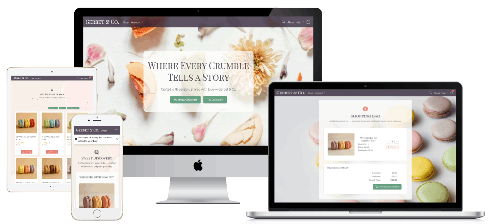

# GERBET & CO

## Table of Contents

-   [Project Description](#project-description)
    -   [Purpose](#purpose)
    -   [User Demographics](#user-demographics)
-   [Business Model & Marketing](#business-model--marketing)
    -   [E-commerce Business Model: Gerbet & Co.](#e-commerce-business-model-gerbet--co)
    -   [Marketing Strategies](#marketing-strategies)
-   [UX design](#ux-design)
    -   [User Stories](#user-stories)
    -   [Wireframes](#wireframes)
    -   [Flowcharts](#flowcharts)
    -   [Key Design Decisions](#key-design-decisions)
        -   [Imagery](#imagery)
        -   [Color Scheme](#colour-scheme)
        -   [Typography](#typography)
        -   [Interactive Elements](#interactive-elements)
-   [Agile Methodology](#agile-methodology)
-   [Features](#features)
    -   [Existing Features](#existing-features)
    -   [Future Features](#future-features)
-   [Technologies](#technologies)
-   [Deployment](#deployment)
    -   [How to clone](#how-to-clone)
    -   [Neon PostgeSQL Database](#neon-postgesql-database)
    -   [Cloudinary API](#cloudinary-api)
    -   [Google API](#google-api)
    -   [Heroku](#heroku)
-   [Testing](#testing)
    -   [Responsivness Testing](#responsivness-testing)
    -   [Browser compatibility Testing](#browser-compatibility-testing)
    -   [User Stories / Features Testing](#user-stories--features-testing)
    -   [Code Validation](#code-validation)
    -   [Performance](#performance)
    -   [Known Issues](#known-issues)
-   [Credits](#credits)
    -   [Media](#media)
    -   [Code](#code)
-   [Acknowledgments](#acknowledgments)

[Back to top](#table-of-contents)

---

# Project Description

Gerbet & Co. is a full-stack e-commerce platform offering luxury handmade French-style macarons and curated tea blends. Built using Django, HTMX, Bootstrap 5 CSS, and PostgreSQL (Neon), the site delivers an elegant, user-friendly shopping experience with a focus on small-batch quality, storytelling, and gift-ready presentation.

The platform includes features such as product filtering, real-time cart updates, Stripe integration, customer account management, and admin-controlled product management. Each product page highlights flavor notes, pairing suggestions, and compelling visuals to support both browsing and buying decisions.

## Purpose

The project was developed as part of a full-stack portfolio to demonstrate strong back-end and front-end integration, dynamic data handling, and thoughtful UX for a niche market. It combines technical precision with a brand-forward design to reflect the personal and artisanal nature of the products.

From a business perspective, the platform supports a direct-to-consumer (DTC) model, empowering small-scale sellers to manage inventory, communicate brand values, and build customer loyalty without relying on third-party marketplaces.

## User Demographics

This site is designed primarily for:

-   Individuals seeking premium, handmade sweets or elegant gift items
-   Tea enthusiasts interested in curated pairings and boutique blends
-   Event planners, couples, and businesses looking for customized favors and treats
-   Customers within Ireland and the broader EU who value artisanal quality and beautiful presentation
-   Mobile and desktop users alike, with responsive design to support browsing and purchasing across devices

[Back to top](#table-of-contents)

---

# Business Model & Marketing

## E-commerce Business Model: Gerbet & Co.

Gerbet & Co. is a small, independent e-commerce business specializing in high-quality French-style macarons and thoughtfully curated tea blends. Rooted in traditional baking techniques and personal craftsmanship, each batch is made in limited quantities with an emphasis on precision, quality, and care.

The shop follows a direct-to-consumer (DTC) model, selling exclusively through its own online platform. This approach allows full control over product quality, packaging, and customer experience. Orders are placed directly through the website and fulfilled from a small-scale production kitchen, with delivery available across Ireland and Europe. Many products are made to order or offered in small seasonal batches to maintain freshness and exclusivity.

## Marketing Strategies

1.  Product-First Storytelling
    Gerbet & Co. emphasizes high-quality ingredients, artisanal techniques, and a meaningful founder story — all of which are showcased in the About page. Visual and written content is crafted to create an emotional connection with customers, presenting each order as a joyful, gift-worthy experience.

2.  Visual Social Media Presence
    A Facebook page layout was created for Gerbet & Co to represent the brand online and support future social media engagement strategies.

        

3.  Email Marketing with a Personal Touch
    Subscribers receive curated emails including seasonal collection announcements, restock alerts, and macaron-tea pairing ideas. Limited batch drops and early access to new products help create urgency and community around the brand.

4.  Niche Positioning
    Marketing efforts are tailored to specific audiences such as gift buyers, tea enthusiasts, and event planners. Customizable options for weddings, birthdays, and corporate gifts allow Gerbet & Co. to stand out in premium gifting categories.

5.  Local SEO & Community Involvement
    To strengthen local visibility, keywords like "macarons Dublin" and "sweet gist ideas" are used throughout the site. The brand also explores partnerships with local businesses and participates in community events and pop-ups to build grassroots awareness.

6.  Focus on the Gifting Experience
    Every product is packaged with care, using minimal yet elegant design. Optional handwritten notes and curated gift sets are offered, making the experience ideal for occasions like anniversaries, holidays, and thank-you gifts.

##

[Back to top](#table-of-contents)

---

# UX Design

## User Stories

The list of user stories can be found in [Gerbet & Co GitHub project](https://github.com/users/tayapro/projects/5).

## Wireframes

### Landing page

### Products page

### Product view page

### Account page

### Account profile page

### Accout profile edit page

### Account profile password update page

### Account address list page

### Account create/update address pages

### Account delete page

### Account order list page

### Account order view page

### Bag page

### Checkout page

### Checkout success page

### Login page

### Register page

### Logout page

### Forget password page

### Error pages

## Flowcharts

Diagrams.net (Draw.io) was used to create the Entity Relationship Diagram (ERD) for the Gerbet & Co project.
It provided a clear and accessible way to map out model relationships and plan the database structure effectively.

## Key Design Decisions

### Imagery

Gerbet & Co embraces a soft and elegant aesthetic, inspired by the charm of artisanal treats and soft elegance.
Product and lifestyle imagery focuses on seasonal macarons, tea moments, and thoughtfully styled packaging
to convey warmth, indulgence, and a handcrafted feel. Each visual was chosen to reflect the calm,
refined nature of the brand.

### Color Scheme

The project applies a refined palette rooted in natural, dessert-inspired tones.
Custom CSS variables define the primary accents:

<table>
    <tr>
        <td></td>
        <td>a muted botanical green</td>
    </tr>
    <tr>
        <td></td>
        <td>a delicate blush coral</td>
    </tr>
    <tr>
        <td></td>
        <td>a deep plum with softened opacity</td>
    </tr>
</table>

These colors are used thoughtfully across backgrounds, buttons, and accents to maintain a cohesive,
gentle design throughout the site.

### Typography

Gerbet & Co uses a font pairing that evokes both elegance and readability:

-   **Playfair Display SC** is used for headings, adding a sense of timelessness and quiet sophistication.
-   **Nunito Sans** supports the main body text, ensuring clarity, balance, and a modern finish.

This combination provides a calm, welcoming reading experience while aligning with the brand’s
handcrafted and refined identity.

[Back to top](#table-of-contents)

---

# Agile Methodology

## GitHub Projects

GitHub Projects was utilized to manage this project following Agile principles. While not a dedicated project management platform, it proved effective when paired with labels, issues, and project boards to organize tasks, track progress, and maintain workflow transparency.

The link to the Gerbet & Co board can be found [here](https://github.com/users/tayapro/projects/5).

Using GitHub Projects, user stories, issues, and tasks were organized and tracked weekly via a simple Kanban board. This approach provided clear visibility into progress and allowed for easy updates and adjustments throughout the development process.

The **MoSCoW prioritization method** was used alongside custom GitHub project labels to effectively organize tasks. This approach ensured that the most critical features were addressed first, helping to maintain focus and make the best use of the available time.

## Milestones

Milestones were used to group related user stories, helping to structure the development process and maintain focus.

This approach supported timely delivery by aligning tasks with priorities and deadlines, ensuring that key features were completed in the right order.

## MoSCoW Prioritization

Before implementation began, high-level Epics were broken down into smaller, actionable user stories. This allowed for the application of the MoSCoW prioritization method within the GitHub Issues tab, using custom labels to categorize and manage task importance.

The MoSCoW method was used to group tasks as follows:

-   **Must Have** – Essential features required for the core functionality and successful delivery.
-   **Should Have** – High-value tasks that enhance the product but aren’t critical for launch.
-   **Could Have** – Nice-to-have features that provide added value but can be deferred.
-   **Won’t Have** – Tasks intentionally excluded from the current development cycle.

This structured approach ensured that key features were delivered first, while still making space for future
enhancements to improve the user experience in later iterations.

[Back to top](#table-of-contents)

---

# Testing

## Responsivness Testing

The layout has been thoroughly tested and optimized for widely used screen resolutions, based on current usage statistics. Responsive design principles ensure a consistent experience across devices. For smaller or uncommon screen sizes, scroll behavior has been applied where needed to maintain accessibility and prevent layout issues.

## Browser compatibility Testing

Testing has been carried out on the following devices:

Macbook Sanoma Version 14.4.1:

Chrome Version 131.0.6778.265
Firefox Version 134.0.2
Samsung S20:

Chrome Version 132.0.6834.80
iPhone 14:

Safari ios 18.1.1
iPad Air 5th generation:

Safari ios 18.1.1
Windows PC:

Firefox 134.0.2 (Windows 11)
Macbook Pro 2019:

Safari ios 17.6

## User Stories / Features Testing

Feature and user story testing were carried out in parallel to reflect their close alignment.
This approach ensured that each implemented feature directly supported its corresponding user story,
delivering intended functionality and value to users. Testing both together also improved efficiency,
allowing for streamlined verification of the overall system and user experience.

-   Test Results Spreadsheet — Column I: User Stories, Column H: Features

-   [User Stories](https://github.com/tayapro/gerbet-and-co/issues)

[Back to top](#table-of-contents)

---

# Credits

## Content

-   The fonts used were imported from Google Fonts.
-   The icons were taken from [Bootstrap Icons](https://icons.getbootstrap.com/) and [Lucide Icons](https://lucide.dev/icons).

## Media

Macaron images were generated with the assistance of ChatGPT image tools for visual consistency across the project.

-   FAQ page <a href="https://www.freepik.com/free-photo/valentines-day-postcard-with-assorted-macarons-pastel-shades-arranged-heart-shape-pris_136731678.htm">Image by frimufilms on Freepik</a>

-   About page:

    -   <a href="https://www.freepik.com/free-photo/young-couple-cooking-together_10041378.htm#fromView=search&page=2&position=41&uuid=9e3ae2f4-1b5c-4d64-90e5-c424de34ca7e&query=bakery+couple">Image by wayhomestudio on Freepik</a>
    -   <a href="https://www.freepik.com/free-photo/young-couple-cooking-together_10041378.htm#fromView=search&page=2&position=41&uuid=9e3ae2f4-1b5c-4d64-90e5-c424de34ca7e&query=bakery+couple">Image by wayhomestudio on Freepik</a>
    -   <a href="https://www.freepik.com/free-photo/valentines-day-postcard-with-assorted-macarons-pastel-shades-arranged-heart-shape-pris_136731667.htm#fromView=search&page=1&position=16&uuid=eafd6a96-97fb-419f-9dd9-71c8fa31f15f&query=macaron">Image by frimufilms on Freepik</a>

-   Account pages <a href="https://www.freepik.com/free-photo/top-view-stacked-colorful-french-macaroons-beautiful-flowers-pink-background_27737542.htm">Image by wirestock on Freepik</a>

-   Bag page <a href="https://www.freepik.com/free-photo/row-baked-macaroon-white-desk_4549574.htm">Image by freepik</a>

-   Checkout page <a href="https://www.freepik.com/free-photo/overhead-view-macaroons-white-backdrop_4577781.htm">Image by freepik</a>

-   Main backround <a href="https://www.freepik.com/free-photo/acrylic-brush-stroke-seashell-wallpaper-image_11303175.htm#fromView=search&page=1&position=35&uuid=9ea3789d-5a4d-4a77-874f-4fa1cda6c397&query=soft+background">Image by rawpixel.com on Freepik</a>

-   Home page:

    -   [slices of macarons and flower petals](https://www.pexels.com/photo/slices-of-macarons-and-flower-petals-on-a-plate-7296706/)
    -   <a href="https://www.freepik.com/free-photo/selective-macaroons-table-with-cream_29505603.htm">Image by wirestock on Freepik</a>
    -   <a href="https://www.freepik.com/free-vector/premium-quality-product-golden-label-design_1798142.htm">Image by starline on Freepik</a>
    -   <a href="https://www.freepik.com/free-vector/best-seller-golden-label-badge-design_1798139.htm">Image by starline on Freepik</a>
    -   <a href="https://www.freepik.com/free-vector/top-rated-golden-label-design_1798143.htm">Image by starline on Freepik</a>
    -   <a href="https://www.freepik.com/free-vector/golden-badge-premium-products_958892.htm#fromView=search&page=1&position=49&uuid=8dcfd24c-1044-4d88-9e35-bafdfca7243d&query=premium_choice_award">Image by starline on Freepik</a>

-   Error pages <a href="https://www.freepik.com/free-photo/row-pink-green-yellow-macaroons-beige-backdrop_4577756.htm">Image by freepik</a>

-   Tea images:
    -   [dried blooming tea balls](https://www.pexels.com/photo/dried-blooming-tea-balls-6787016/)
    -   [full shot of dried tea](https://www.pexels.com/photo/full-shot-of-dried-tea-lea-5501116/)
    -   [dry flowers fruits and leaves](https://www.pexels.com/photo/dry-flowers-fruits-and-leaves-6787017/)
    -   [green tea with fruits leaves](https://www.pexels.com/photo/green-dried-leaves-on-ground-6087394/)
    -   [rooibos tea](https://www.pexels.com/photo/close-up-shot-of-rooibos-tea-6087602/)
    -   [chamomile tea](https://www.pexels.com/photo/yellow-flower-837275/)
    -   [black tea](https://www.pexels.com/photo/close-up-shot-of-dried-tea-leaves-6087517/)
    -   [loose mallow tea](https://www.pexels.com/photo/a-pile-of-loose-mallow-flowers-5988312/)
    -   [hibiscus tea](https://www.pexels.com/photo/a-close-up-shot-of-loose-tea-leaves-5987947/)
    -   [tea with fruits](https://www.pexels.com/photo/dried-tea-leaves-5501118/)
    -   [jasmine tea](https://www.pexels.com/photo/a-pile-of-loose-jasmine-tea-leaves-5988043/)
    -   [calendula tea](https://www.pexels.com/photo/top-view-of-dried-orange-flowers-5988272/)
    -   [green tea](https://www.pexels.com/photo/pile-of-dried-leaves-5988177/)
    -   [rooibos tea](https://www.pexels.com/photo/close-up-shot-of-rooibos-tea-6087602/)

## Code

-   Radio buttons are adapted from the [RADIO BUTTONS ON SORT & FILTER SIDEBAR](https://codepen.io/Noeh-l/pen/QWVxdNr)
-   Understanding of Django with [Django documentation](https://docs.djangoproject.com/en/5.1/)
-   Understanding of [Stripe payments with Django](https://www.youtube.com/watch?v=IzxNNWjYsPk)

[Back to top](#table-of-contents)

---

# Acknowledgments

Special thanks to mentor Jubril Akolade for his invaluable guidance and support throughout the project.
Appreciation is also extended to the Code Institute Slack Community for providing valuable resources
and assistance during development.

[Back to top](#table-of-contents)

---
